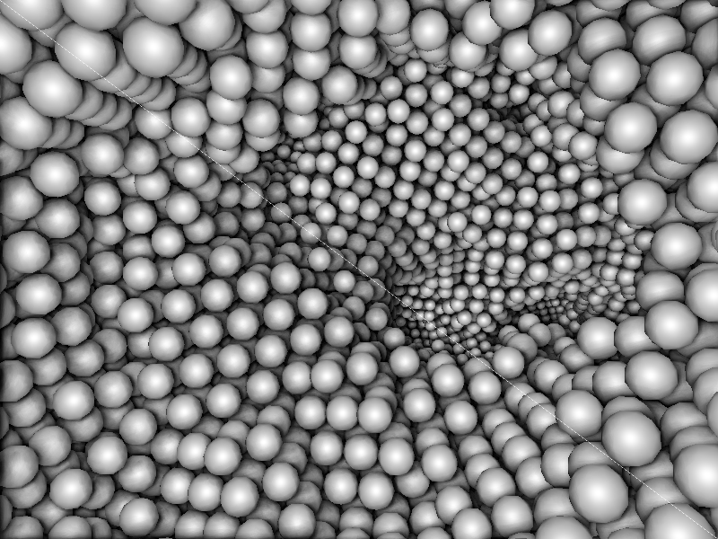

# Superpunto

Superpunto is a fast sphere visualizer with superb light effects. Via a simple format (similar to the XYZ format) one can visualize the trajectories of a large number of spherical particles in an interactive way.


<p align="center">
  
  
</p>

Superpunto was born as a SDL2/OpenGL4.5 clone of mrevenga's SDL punto ( http://punto.sourceforge.net/ )

## Installation

**Superpunto is available in conda** as a [conda-forge](https://conda-forge.org/) package. You can install it using the following command:

```bash
conda install -c conda-forge superpunto
```

### Linux or Windows under WSL (AppImage)

The Github release page offers prebuilt binaries for Linux in the form of AppImages. These are self-contained executables that include all the necessary libraries and dependencies to run the application.  
You can copy paste this command in your terminal to download and place into your PATH the latest one, after which the command "spunto" will be available.
```bash
mkdir -p ~/.local/bin && curl -L https://github.com/RaulPPelaez/superpunto/releases/latest/download/spunto-x86_64.AppImage -o ~/.local/bin/spunto && chmod +x ~/.local/bin/spunto
```

Prebuilt AppImages are generated automatically for each release. You can see them in the [Releases](https://github.com/RaulPPelaez/superpunto/releases) page.

To run the AppImage:

```bash
chmod +x spunto-x86_64.AppImage
./spunto-x86_64.AppImage
```
Runs on most Linux distributions (glibc ≥ 2.31)

You can place the AppImage somewhere in your PATH for easier access:

```bash
cp spunto-x86_64.AppImage ~/.local/bin/spunto
```
Then you can run it from anywhere.

<!-- ### MacOS -->
<!-- **One-line install**   -->
<!-- You can copy paste this command in your terminal, after which the command "spunto" will be available. -->
<!-- ```bash -->
<!-- mkdir -p ~/Applications && cd /tmp && curl -L https://github.com/RaulPPelaez/superpunto/releases/latest/download/Superpunto.dmg -o Superpunto.dmg && hdiutil attach Superpunto.dmg -mountpoint /Volumes/Superpunto -nobrowse && cp -R /Volumes/Superpunto/Superpunto.app ~/Applications/ && ln -sf ~/Applications/Superpunto.app/Contents/MacOS/spunto ~/.local/bin/spunto && hdiutil detach /Volumes/Superpunto -->
<!-- ``` -->
<!-- This command will download the latest `Superpunto.dmg` file and install the app in the `~/Applications` folder. It will also create a symbolic link to the executable in `~/.local/bin/`, a folder that is included in the PATH for latest macOS versions. -->

<!-- Prebuilt dmg files are generated automatically for each release. You can download the latest version from the [Releases](https://github.com/RaulPPelaez/superpunto/releases) page. -->

### Building from Source

If you prefer to build the project yourself, there are multiple supported options:

#### Get the Source Code

```bash
git clone https://github.com/RaulPPelaez/superpunto.git
cd superpunto
```
#### Dependencies
Make sure you have the following dependencies installed:
- CMake
- C++ Compiler (g++, clang++)
- OpenGL 4.5
- SDL2
- SDL2_ttf
- libGLEW
- libPNG
- (Optional) ffmpeg for recording

You can install these dependencies using your package manager. For example, on Ubuntu:

```bash
$ sudo apt install cmake g++ libsdl2-dev libsdl2-ttf-dev libglew-dev libpng-dev ffmpeg
```
Or in Fedora:
```bash 
$ sudo dnf install SDL2-devel SDL2_ttf-devel libpng-devel libGLEW ffmpeg glew-devel
```
<!-- Or in MacOS: -->
<!-- ```bash -->
<!-- brew install cmake sdl2 sdl2_ttf glew libpng -->
<!-- ``` -->

Or use the provided `environment.yml` file to create a [Conda](https://github.com/conda-forge/miniforge) environment:

```bash
conda env create -f environment.yml
conda activate spunto-env
```

**Compile**  

Superpunto is built using CMake. You can build it in a separate directory:

```bash
mkdir build
cd build
cmake ..
make -j install
```
If you want to install it system-wide, you will need to run the `make install` command with `sudo`:

```bash
sudo make install
```

If using conda, you must instruct CMake to use the conda paths:

```bash
cmake -DCMAKE_PREFIX_PATH=$CONDA_PREFIX -DCMAKE_PREFIX_PATH=$CONDA_PREFIX ..
```

#### Additional Compilation Options

**Build the AppImage**  

If you want to build the AppImage, you can do so by adding the `-DBUILD_APPIMAGE=ON` option to the CMake command:

```bash
cmake -DBUILD_APPIMAGE=ON ..
```

# USAGE
Run with 
```bash
$ ./spunto inputfile [opts]
```

**Run `spunto -h` for information about the available options and controls.**

## Input File
The inputfile should have the following structure:

	#Lx=X;Ly=Y;Lz=Z; Comments are used to separate frames, you can force the size of the simulation box starting the comment as in this example. All three L must be provided
	X1 Y1 Z1 r1 c1 #You can comment here aswell. If your file has more than
	X2 ...         # 5 columns, the rest will be ignored!
	.
	.
	# frame=2
	X1 Y1 Z1 r1 c1
	.
	.
	# frame = 3

The columns correspond to the three dimensional coordinates of each particle (XYZ), the radius (r) and the color (c).

If some of the columns are missing, this is the behavior according to the number of columns:

	3: XYZ ->r=1, c=0
	4: XYZC -> r=1

### About colors

The column color can be treated in two ways:

**Default** or using --palette X
	
The default palette is "superpunto", which understands colors as an integer number between 0 an 1000. The palette is random inside that range.  
Additionally, any palette from [matplotlib](https://matplotlib.org/stable/tutorials/colors/colormaps.html) can be passed to `--palette`, in which case the color column will be treated as a float between 0 and 1.

**RGB** by using --RGB

The colors will be treated as an BGR hexadecimal color, i.e. being 255 = 0xFF = red and 16711680 = 0xFF0000 = blue.


## Selecting spheres

Clicking one sphere with the left mouse button will highlight it and print its coordinates. Clicking a second one with the right click will print its coordinates too, in addition to the distance between both.

