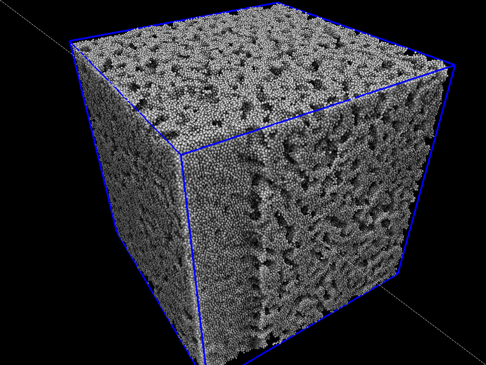

# Superpunto
SDL2/OpenGL4.5 clone of mrevenga's SDL punto ( http://punto.sourceforge.net/ )

Now with SSAO and superb light effects!!



# COMPILATION
Run the Makefile using $ make


Dependencies:

1. SDL2 https://www.libsdl.org/ . In the official repositories of most modern distributions.

2. SDL2_ttf

3. OpenGL 4.5

4. libGLEW 1.13.0+ (default in the Ubuntu 16.04 repos)

5. libPNG for the screenshots

6. (Optional) avconv installed for recording, not having it will simply cause the recording button to do nothing.

## In Fedora 35:

```bash 
$ sudo dnf install SDL2-devel SDL2_ttf-devel libpng-devel libGLEW ffmpeg glew-devel
```

# USAGE
Use with $ ./spunto inputfile [opts]

run ./spunto -h for information about the available options and controls.


inputfile should have the following structure:

	#Lx=X;Ly=Y;Lz=Z; Comments are used to separate frames, you can force the size of the simulation box starting the comment as in this example. All three L must be provided

	X1 Y1 Z1 r1 c1 Vx Vy Vz#You can comment here aswell! If your file has more than
	
	X2 ...         #8 columns, the rest will be ignored!

	.

	.

	.

	\# frame=2

	X1 Y1 Z1 r1 c1 Vx Vy Vz

	.

	.

	.

	\# frame = 3

r1 is the size of the superpunto.

c1 is its color.

Vxyz are the sizes of the arrows if --renderer arrows is selected.

If some of the columns are missing, this is the behavior according to the number of columns:

	3: XYZ ->r=1, c=0, Vxyz=0
	4: XYZC -> r=1, Vxyz=0
	5: XYZRC -> Vxyz=0
	6: XYZVxVyVz -> r=1, c=0
	7: XYZCVxVyVz -> r=1
	8: XYZRCVxVyVz

# COLORS

The column color can be treated in two ways:

**Default** or using --palette X

	The colors are selected using C++ rand(), setting the initial seed to a constant given by --palette (or 923302100 by default), this constant defines a color palette with colors randomly distributed between 0 (black) and 255^3(white). The generated color palette contains 1000 colors.

	The exceptions are id=0 -> red, id=1 ->green, id=2 -> blue


**RGB** by using --RGB

	The colors will be treated as an BGR hexadecimal color, i.e. being 255 = 0xFF = red and 16711680 = 0xFF0000 = blue.


#OPTIONS AND CONTROLS

**Options:**

	--record :  Makes a movie of all the frames in file and generates a .mp4
	--frames-between-screenshots X : Number of frames skipped between screenshots when recording (default = 2)
	--background R G B : Background color in RGB, default R=G=B=0.0
	--palette X : Change the color palette
	--RGB : Read colors as hex values in BGR (as integers) (0xFF=red=255). Overrides palette
	--renderer [render=arrows,particles]: Rendering mode.
	
**Controls:**
	
Movement:
	
	Move with WASD, E and Q to tilt and Shift/Ctrl to go up/Down
	Use +/- to increase/decrease the speed
	Look around holding ALT and moving the mouse
	Rotate the world in XYZ using 123/456
	Frame control:
	Press Space to go to the next frame, R to the previous
	Press T to go to the last frame, B takes you to the first one
	Press M to play the frames at 60 FPS, M again to pause
	Press C to take a screenshot in png
	Press L to play and record to a mp4 until L is pressed again
	
**Others:**

	Press h to print this help page
	


